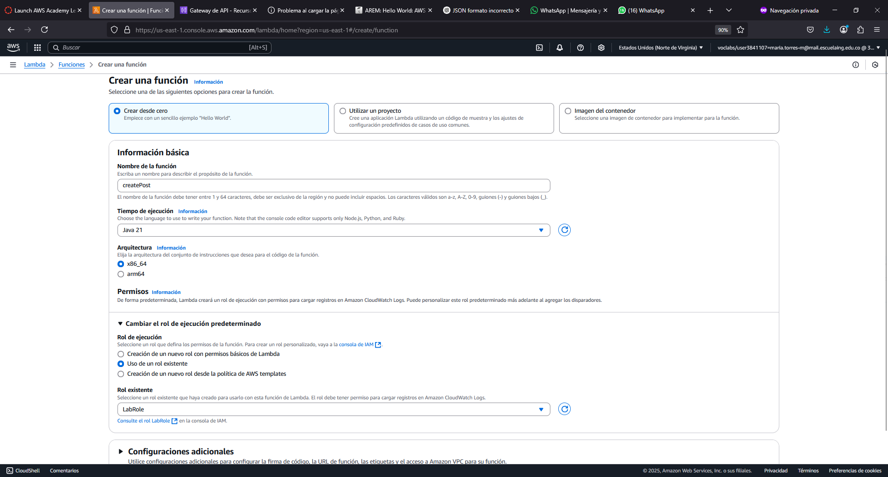
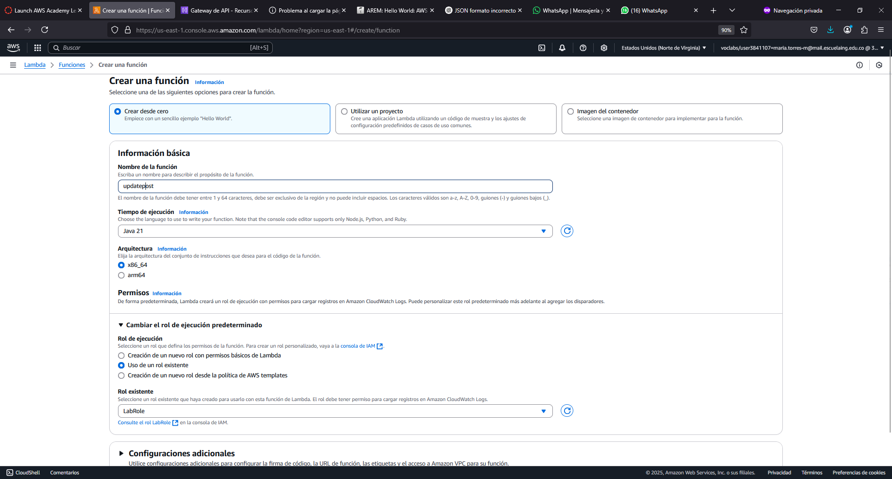
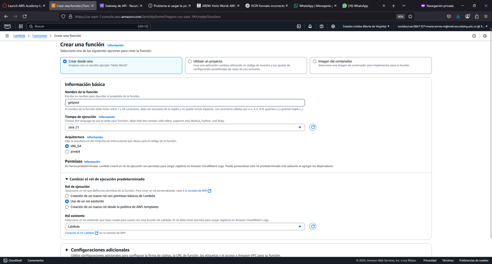
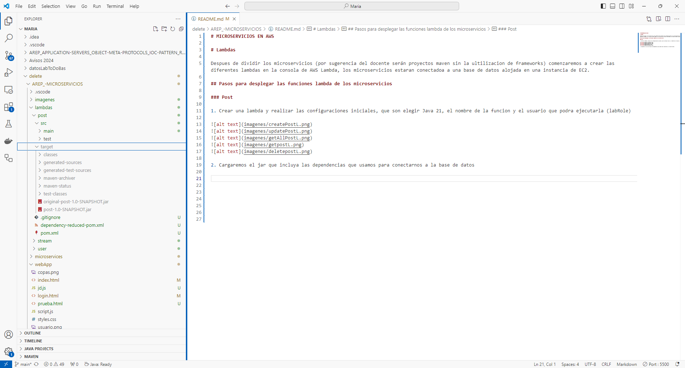
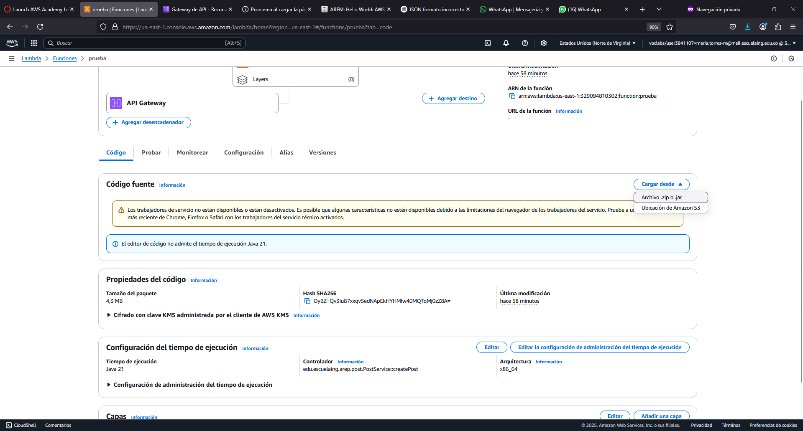
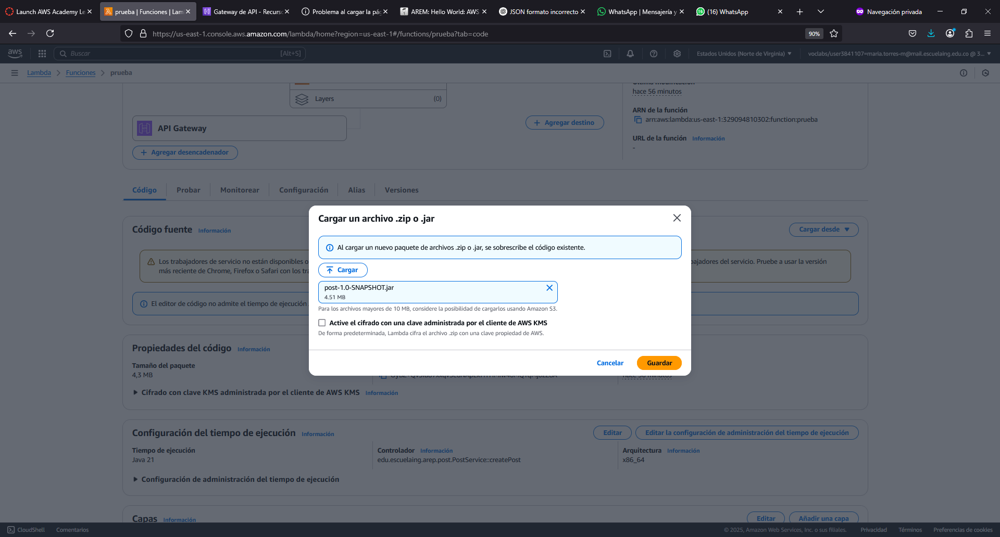
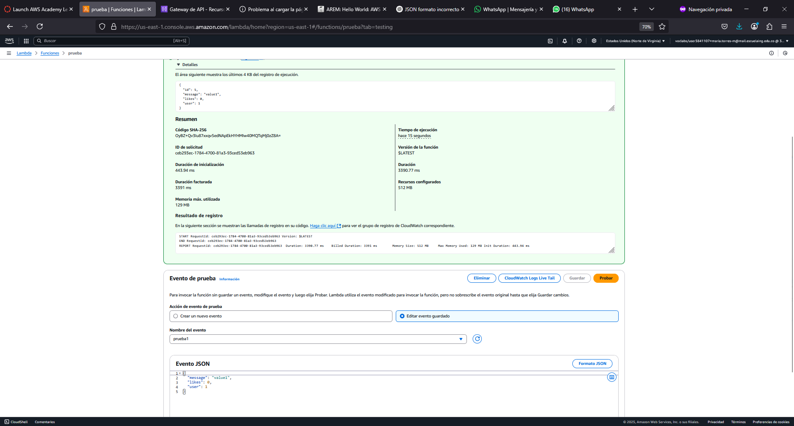

# MICROSERVICIOS EN AWS

# Lambdas

Despues de dividir los microservicios (por sugerencia del docente serán proyectos maven sin la ultilizacion de frameworks) comenzaremos a crear las diferentes lambdas en la consola de AWS Lambda, los microservicios estaran conectadoa a una base de datos alojada en una instancia de EC2.

## Pasos para desplegar las funciones lambda de los microservicios

### Post

1. Crear una lambda y realizar las configuraciones iniciales, que son elegir Java 21, el nombre de la funcion y el usuario que podra ejecutarla (labRole)

2. Compilamos si no lo hemos hecho para crear el jar que incluya las dependencias que usamos para conectarnos a la base de datos, para compilar tendremos que:
- Dirigirnos a la carpeta donde esta el pom.xml de post con el comando :

cd AREP_-MICROSERVICIOS/lambdas/post

- Luego usamos el comando mvn clean package y obtendremos el siguiente resultado:

[INFO] Replacing D:\2025-1\Maria\delete\AREP_-MICROSERVICIOS\lambdas\post\target\post-1.0-SNAPSHOT.jar with D:\2025-1\Maria\delete\AREP_-MICROSERVICIOS\lambdas\post\target\post-1.0-SNAPSHOT-shaded.jar
[INFO] Dependency-reduced POM written at: D:\2025-1\Maria\delete\AREP_-MICROSERVICIOS\lambdas\post\dependency-reduced-pom.xml
[INFO] ------------------------------------------------------------------------
[INFO] BUILD SUCCESS
[INFO] ------------------------------------------------------------------------
[INFO] Total time:  3.028 s
[INFO] Finished at: 2025-03-20T09:41:18-05:00
[INFO] ------------------------------------------------------------------------

3. Con esto lo subiremos a las 5 funciones lambda que creamos anteriormente, a continuacion mostraremos el proceso para una sola de estas funciones pero el paso se debe repetir en todas

4. Podremos realizar las pruebas para verificar que funciona correctamente antes de integralas al API gateway.

- Crear post

- Actualizar post

- Listar todos los Post

- Mostrar Post

